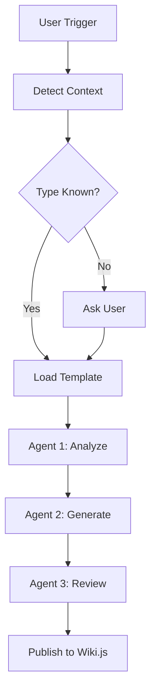
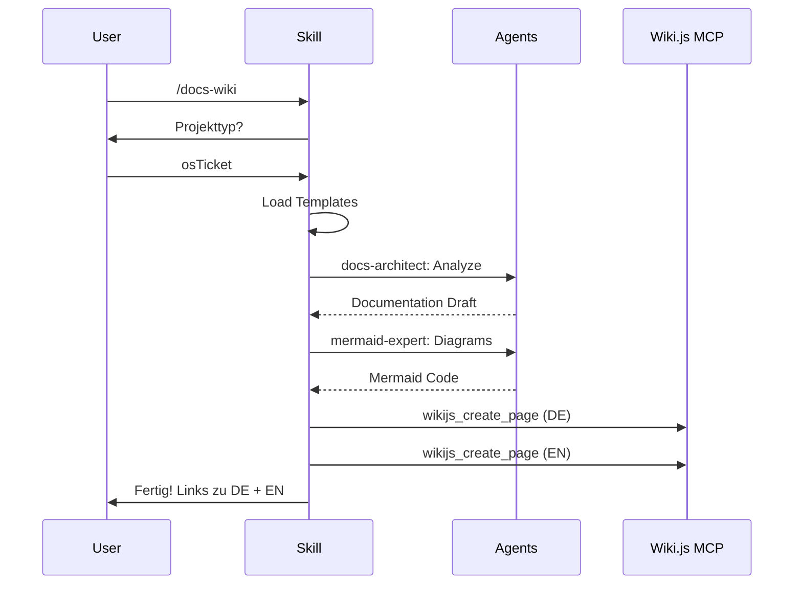

# Claude Agent/Skill - Wiki.js Dokumentation

## Wiki.js Metadaten

- **Pfad-Pattern:** `agents/{agent-name}` oder `skills/{skill-name}`
- **Pflicht-Tags DE:** `claude`, `agent` oder `skill`, `{thema}`
- **Pflicht-Tags EN:** `claude`, `agent` oder `skill`, `{topic}`
- **Plattform-Agent:** Keiner (Meta-Dokumentation)

## Badge-Vorlage

Keine Badges fuer Agents/Skills (keine externen Repos).

Falls doch ein Repo existiert:

```markdown
[](https://github.com/markus-michalski/{REPO_NAME})
[](https://github.com/markus-michalski/{REPO_NAME}/blob/main/LICENSE)
```

## Seiten-Struktur (Sektionen in dieser Reihenfolge)

Die Sektionen unten sind nicht eine Seite, sondern werden nach der Regel "Hub + Unterseiten"
(siehe DOCS_COMMON.md) auf Hub und Unterseiten verteilt. Die Nummern bleiben die Reihenfolge
innerhalb ihrer Seite. Eine Unterseite wird nur angelegt, wenn es dazu Inhalt gibt.

| Seite | Pfad | Sektionen |
|-------|------|-----------|
| Hub | `plugins/{name}` | 1, 3, 4 (kurz, mit Dokumentations-Tabelle) |
| Agents | `.../agents` | 5 (PFLICHT-Seite) |
| Workflow | `.../workflow` | 6, 7, 9 |
| Konfiguration | `.../configuration` | 8, 10 |
| Erweiterbarkeit | `.../extending` | 14 |
| Fehlerbehebung | `.../troubleshooting` | 11, 13 |
| Technik | `.../technical` | 12 |

Sektion "Inhaltsverzeichnis (manuell)" entfaellt, sie wird durch die Dokumentations-Tabelle auf dem Hub ersetzt.


### 1. Titel + Sprachlink

### 2. Inhaltsverzeichnis (manuell)

### 3. Ueberblick
- Was macht der Agent/Skill
- Wann wird er getriggert
- Callout Box:

```markdown
> Dieser Skill wird automatisch aktiviert wenn: [Trigger-Beschreibung]
{.is-info}
```

### 4. Trigger / Aktivierung
- Wie wird der Agent/Skill ausgeloest
- Slash-Commands (z.B. `/docs-wiki`)
- Natuerlichsprachliche Trigger

### 5. Verfuegbare Agents / Sub-Agents (PFLICHT)
- IMMER als Tabelle:

```markdown
| Agent | Typ | Beschreibung |
|-------|-----|-------------|
| `docs-architect` | documentation-generation | Technische Dokumentation |
| `mermaid-expert` | documentation-generation | Diagramme |
```

### 6. Workflow
- Nummerierte Schritte
- Entscheidungspunkte klar markiert
- Flow-Diagramm (Mermaid PFLICHT)

### 7. Templates (falls vorhanden)
- Welche Templates geladen werden
- Template-Mapping-Tabelle:

```markdown
| Kontext | Template |
|---------|----------|
| Typ A | `templates/TypeA/TEMPLATE.md` |
| Typ B | `templates/TypeB/TEMPLATE.md` |
```

### 8. Konfiguration
- Einstellungen, die das Verhalten beeinflussen
- CLAUDE.md Referenzen

### 9. Beispiel-Workflows (mindestens 2)

```markdown
### Beispiele {.tabset}

#### Einfacher Workflow
1. User: "/skill-name"
2. Skill fragt: ...
3. Skill laed Template
4. Ergebnis

#### Erweiterter Workflow
1. User: "/skill-name TypeA projekt-name details"
2. Skill parsed Input
3. Ueberspringt Fragen
4. Ergebnis
```

### 10. Integration mit anderen Tools
- Wiki.js MCP
- osTicket MCP
- GitHub CLI
- Andere Skills

### 11. Fehlerbehebung
- Template nicht gefunden
- Agent nicht verfuegbar
- MCP nicht erreichbar

### 12. Technische Details
- Skill-Verzeichnisstruktur
- Workflow-Diagramm (Mermaid PFLICHT)
- Abhaengigkeiten zu anderen Skills/Agents

### 13. FAQ

### 14. Erweiterbarkeit
- Wie neue Typen/Templates hinzugefuegt werden
- Namenskonventionen

## Mermaid-Diagramm-Vorlage

Agent-Orchestrierung:

````markdown

````

Skill-Workflow:

````markdown

````

## Agent-Einsatz fuer Agent/Skill-Dokumentation

1. **docs-architect** → SKILL.md, Templates, Scripts analysieren
2. **mermaid-expert** → Workflow-Diagramm, Agent-Orchestrierung
3. **tutorial-engineer** → Beispiel-Workflows, Quick-Start-Guide
