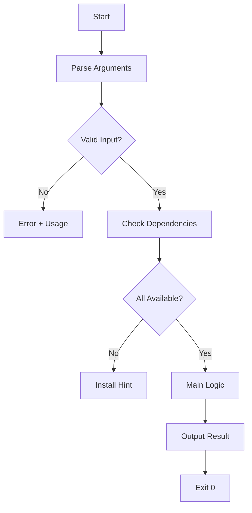

# Bash/Shell Script - Wiki.js Dokumentation

## Wiki.js Metadaten

- **Pfad-Pattern:** `scripts/{script-name}` (z.B. `scripts/oxid-module-release`)
- **Pflicht-Tags DE:** `bash`, `script`, `{thema}`
- **Pflicht-Tags EN:** `bash`, `script`, `{topic}`
- **Plattform-Agent:** Keiner (Bash ist generisch)

## Badge-Vorlage

```markdown
[](https://github.com/markus-michalski/{REPO_NAME})
[](https://github.com/markus-michalski/{REPO_NAME}/blob/main/LICENSE)
[](https://www.gnu.org/software/bash/)
[](https://www.shellcheck.net/)
```

## Seiten-Struktur (Sektionen in dieser Reihenfolge)

Die Sektionen unten sind nicht eine Seite, sondern werden nach der Regel "Hub + Unterseiten"
(siehe DOCS_COMMON.md) auf Hub und Unterseiten verteilt. Die Nummern bleiben die Reihenfolge
innerhalb ihrer Seite. Eine Unterseite wird nur angelegt, wenn es dazu Inhalt gibt.

| Seite | Pfad | Sektionen |
|-------|------|-----------|
| Hub | `bash-scripts/{tool}` | 1, 3, 4, 5, 14 (kurz, mit Dokumentations-Tabelle) |
| Installation | `.../installation` | 6 |
| Verwendung | `.../usage` | 7, 9 |
| Optionen | `.../options` | 8 (PFLICHT bei CLI-Scripts) |
| Konfiguration | `.../configuration` | 10 |
| Fehlerbehebung | `.../troubleshooting` | 11, 13 |
| Technik | `.../technical` | 12 |

Sektion "Inhaltsverzeichnis (manuell)" entfaellt, sie wird durch die Dokumentations-Tabelle auf dem Hub ersetzt.


### 1. Titel + Badges + Sprachlink

### 2. Inhaltsverzeichnis (manuell)

### 3. Ueberblick
- Was macht das Script, welches Problem loest es
- Callout Box:

```markdown
> Automatisiert [Aufgabe] - spart [Zeitersparnis] pro Ausfuehrung.
{.is-info}
```

### 4. Features
- Feature-Liste

### 5. Anforderungen
- Tabelle: Anforderung | Version | Hinweise
- Bash 5.0+, externe Tools (jq, curl, etc.)

### 6. Installation

```bash
# Download
curl -O https://raw.githubusercontent.com/markus-michalski/{repo}/main/{script}.sh
chmod +x {script}.sh

# Oder Git Clone
git clone https://github.com/markus-michalski/{repo}.git
```

### 7. Verwendung / Synopsis

```markdown
### Synopsis

\`\`\`bash
./{script}.sh [OPTIONS] <required-arg> [optional-arg]
\`\`\`
```

### 8. Optionen (PFLICHT fuer CLI-Scripts)
- IMMER als Tabelle:

```markdown
| Option | Kurz | Beschreibung | Standard |
|--------|------|-------------|----------|
| `--verbose` | `-v` | Ausfuehrliche Ausgabe | Aus |
| `--dry-run` | `-n` | Nur simulieren | Aus |
| `--output` | `-o` | Ausgabedatei | stdout |
```

### 9. Beispiele (mindestens 3)

```markdown
### Beispiele {.tabset}

#### Einfache Verwendung
\`\`\`bash
./script.sh input.txt
\`\`\`

#### Mit Optionen
\`\`\`bash
./script.sh --verbose --output result.txt input.txt
\`\`\`

#### Dry Run
\`\`\`bash
./script.sh --dry-run input.txt
\`\`\`
```

### 10. Konfiguration (falls Config-Datei vorhanden)
- Environment Variables oder Config-Datei

### 11. Fehlerbehebung
- Haeufige Fehler mit Symptoms → Check → Solution

> Permission denied? Script ausfuehrbar machen:
> ```bash
> chmod +x script.sh
> ```
{.is-warning}

### 12. Technische Details
- Script-Struktur (Funktionen)
- Execution-Flow-Diagramm (Mermaid PFLICHT)
- Abhaengigkeiten
- Exit Codes als Tabelle

```markdown
| Exit Code | Bedeutung |
|-----------|-----------|
| 0 | Erfolgreich |
| 1 | Allgemeiner Fehler |
| 2 | Fehlende Abhaengigkeit |
```

### 13. FAQ

### 14. Lizenz

## Mermaid-Diagramm-Vorlage

Execution-Flow:

````markdown

````

## Agent-Einsatz fuer Bash/Shell

1. **docs-architect** → Script-Datei analysieren, Funktionen dokumentieren
2. **mermaid-expert** → Execution-Flow-Diagramm
3. **tutorial-engineer** → Verwendungsbeispiele als Tabs
4. **reference-builder** → Options-Tabelle, Exit Codes, Environment Variables
