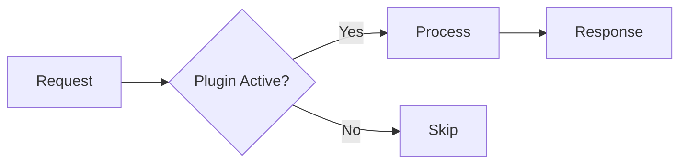

# Gemeinsame Regeln - Wiki.js Dokumentation

Diese Regeln gelten fuer ALLE Projekttypen. Immer zusammen mit dem typ-spezifischen Template laden.

## Bilingual - PFLICHT

Jede Wiki.js-Seite wird in **DE und EN** erstellt/aktualisiert.

- Gleicher Pfad, unterschiedliche Locale (`locale: "de"` / `locale: "en"`)
- Sprachlink oben auf jeder Seite:
  - DE-Seite: `[English Version](https://faq.markus-michalski.net/en/{path})`
  - EN-Seite: `[Deutsche Version](https://faq.markus-michalski.net/de/{path})`
- Code-Beispiele, CLI-Befehle, technische Terme bleiben in beiden Versionen gleich
- Nur Fliesstext, Ueberschriften, Beschreibungen uebersetzen

## Wiki.js Enhanced Markdown - PFLICHT

Nutze diese Wiki.js-spezifischen Markdown-Features aktiv:

### Callout Boxes (statt normaler Absaetze fuer Warnungen/Tipps)

```markdown
> Wichtiger Sicherheitshinweis: API-Keys niemals im Code speichern.
{.is-warning}

> Tipp: Nutze separate API-Keys fuer verschiedene Integrationen.
{.is-info}

> Fehler: Plugin nicht kompatibel mit osTicket < 1.18
{.is-danger}

> Erfolgreich installiert! Das Plugin ist sofort einsatzbereit.
{.is-success}
```

**KRITISCH - Callout Boxes NIE im Quelltext umbrechen:**

Wiki.js fasst mehrzeilige `>`-Bloecke NICHT wie Standard-CommonMark zu Fliesstext zusammen —
jeder einzelne Zeilenumbruch im Quelltext wird als hartes `<br>` gerendert. Ein Callout muss daher
**immer eine einzige, unumbrochene Zeile** sein, unabhaengig von der Laenge:

```markdown
> Wichtiger Hinweis: Diese lange Warnung wurde bei ca. 90 Zeichen        <-- FALSCH
> umgebrochen, um im Editor besser lesbar zu sein, und rendert in
> Wiki.js mit sichtbaren Zeilenumbruechen mitten im Satz.
{.is-warning}

> Wichtiger Hinweis: Diese lange Warnung steht als eine einzige, unumbrochene Zeile im Quelltext und rendert in Wiki.js als normaler Fliesstext ohne sichtbare Umbrueche.   <-- KORREKT
{.is-warning}
```

### Content Tabs (fuer alternative Wege)

```markdown
### Installation {.tabset}

#### Composer (Empfohlen)
composer require mmd/plugin-name

#### ZIP Download
1. Download von GitHub Releases
2. Entpacken nach /include/plugins/

#### Git Clone
git clone https://github.com/markus-michalski/repo-name.git
```

### Mermaid-Diagramme (mindestens 1 pro Seite!)

**KRITISCH - Wiki.js Mermaid 8.8.2 Kompatibilitaet:**

Wiki.js nutzt Mermaid 8.8.2. Folgende Regeln sind PFLICHT:

1. **`graph` statt `flowchart`** - `flowchart` wird NICHT unterstuetzt
   - `graph TD` (top-down) statt `flowchart TD`
   - `graph LR` (left-right) statt `flowchart LR`

2. **Alle Node-Labels in Anfuehrungszeichen** - Sonderzeichen-Sicherheit
   - `A["Label mit Sonderzeichen"]` statt `A[Label mit Sonderzeichen]`

3. **Kein `::` in Labels** - Mermaid interpretiert `::` als CSS-Klassen-Zuweisung
   - `A["enable()"]` statt `A["Plugin::enable()"]`
   - Kurzform nutzen oder Punkt statt Doppelpunkt: `Plugin.enable()`

4. **Kein `*` in Labels** - Wird als Markdown interpretiert
   - `A["removeAll()"]` statt `A["remove*()"]`

````markdown

````

### Bild-Dimensionen (wenn Bilder vorhanden)

```markdown


```

## Keine Emojis in Ueberschriften

UTF8MB4-Encoding-Problem in osTicket/Wiki.js. Emojis nur im Fliesstext erlaubt.

```markdown
## Systemanforderungen              <-- Korrekt
## 🎯 Systemanforderungen           <-- FALSCH (wird zu ????)
```

Diese Regel gilt auch dann, wenn der User eine Ueberschrift woertlich mit Emoji vorgibt — das
Emoji vor der Uebernahme entfernen, nie unveraendert in die veroeffentlichte Seite durchreichen.

## Keine Versionsnummern im Fliesstext - PFLICHT

Wiki.js-Seiten beschreiben immer nur den **aktuellen Stand** des Plugins/Moduls, keine Versionshistorie.

- KEINE "(ab vX.Y.Z)"-Zusaetze an Ueberschriften oder Feature-Beschreibungen — Versionsnummern
  veralten sofort wieder und muessen bei jedem Release nachgepflegt werden (macht in der Praxis
  niemand)
- Versionsgeschichte gehoert ins CHANGELOG.md des Repos, nicht ins Wiki
- Stattdessen: direkt unter dem Sprachlink/den Badges am Seitenanfang ein Hinweis-Callout, dass
  sich die Doku immer auf die aktuellste Version bezieht
- Diese Regel gilt auch dann, wenn der User selbst eine Versionsnummer nennt und erwartet, dass sie
  dokumentiert wird — die Versionsnummer nicht in Ueberschrift/Fliesstext uebernehmen, sondern auf
  das CHANGELOG verweisen (das Hinweis-Callout deckt das ab)

```markdown
> Diese Dokumentation bezieht sich immer auf die aktuellste veroeffentlichte Version. Fuer
> aeltere Versionen siehe das [CHANGELOG](https://github.com/markus-michalski/{repo}/blob/main/CHANGELOG.md).
{.is-info}
```

EN-Pendant:

```markdown
> This documentation always describes the latest published version. For older versions, see
> the [CHANGELOG](https://github.com/markus-michalski/{repo}/blob/main/CHANGELOG.md).
{.is-info}
```

## Agent-Orchestrierung

Agents in dieser Reihenfolge einsetzen. Nicht alle sind bei jedem Projekt noetig.

### 1. docs-architect (IMMER)

Codebase analysieren und Hauptdokumentation schreiben.

**Prompt-Hinweise fuer den Agent:**
- README.md, CHANGELOG.md, composer.json/package.json lesen
- Quellcode-Struktur verstehen (src/, tests/, config/)
- Bestehende Doku als Basis nehmen (falls Update/Upgrade)
- Wiki.js Enhanced Markdown verwenden

### 2. mermaid-expert (IMMER)

Mindestens 1 Diagramm pro Seite erstellen.

**WICHTIG:** Mermaid 8.8.2 Kompatibilitaetsregeln beachten (siehe oben):
- `graph` statt `flowchart`, Labels in Quotes, kein `::` oder `*` in Labels

**Diagramm-Typen nach Bedarf:**
- Flowchart (`graph TD`/`graph LR`): Plugin-Lifecycle, Entscheidungslogik
- Sequence: API Request/Response Flow
- Class: Klassen-Struktur (bei komplexen Plugins)
- ER: Datenbank-Schema (bei DB-Erweiterungen)

### 3. tutorial-engineer (bei Neue Doku / Qualitaets-Upgrade)

Step-by-Step Guides mit Tabs fuer alternative Wege.

**Fokus auf:**
- Installation (verschiedene Methoden als Tabs)
- Haeufigste Use Cases mit konkreten Werten
- Troubleshooting als "Symptoms → Check → Solution" Pattern

### 4. api-documenter (nur bei Projekten mit API)

API-Referenz mit Tabellen.

**Erstelle Tabellen fuer:**
- Endpunkte: Method, Path, Description, Parameters
- Parameter: Name, Type, Required, Default, Description
- Response-Codes: Code, Description, Example

### 5. reference-builder (bei umfangreicher Konfiguration)

Parameter- und Config-Referenz-Tabellen.

**Erstelle Tabellen fuer:**
- Environment Variables
- Plugin-Settings
- CLI-Optionen
- Custom Fields

## Wiki.js MCP-Workflow

### isPublished PFLICHT

**KRITISCH:** Bei JEDEM `wikijs_create_page` und `wikijs_update_page` Aufruf
IMMER `isPublished: true` explizit setzen! Ohne diesen Parameter werden
Seiten versehentlich als Draft gespeichert.

```
wikijs_create_page(path, locale, content, ..., isPublished: true)
wikijs_update_page(path, locale, content, ..., isPublished: true)
```

### Source-Ref-Tracking (wenn verfuegbar)

Bevor Content geschrieben wird: im Zielprojekt-Verzeichnis (dem Repo, das dokumentiert wird)
den aktuellen Git-Stand ermitteln:

```bash
git -C {zielprojekt-pfad} rev-parse HEAD
# oder, falls das Projekt Tags nutzt:
git -C {zielprojekt-pfad} describe --tags --always
```

Ist das Zielprojekt kein Git-Repo (oder der Befehl schlaegt fehl), Source-Ref-Tracking einfach
auslassen — `sourceRepo`/`sourceRef`/`summary` sind optionale Parameter, kein Blocker fuer den
Publish-Schritt.

Ist ein Git-Stand ermittelbar, bei JEDEM `wikijs_create_page`/`wikijs_update_page`-Aufruf
zusaetzlich mitgeben:

```
wikijs_create_page(path, locale, content, ..., isPublished: true,
                    sourceRepo: "{projektname aus Schritt 2}", sourceRef: "{git-hash}",
                    summary: "{ein Satz, was dokumentiert wurde}")
```

`sourceRepo`/`sourceRef`/`summary` landen NUR in einer lokalen Historie
(`wikijs_get_page_history`) — nie im sichtbaren Seiteninhalt oder in der Description. Das erhaelt
die "Keine Versionsnummern im Fliesstext"-Regel oben, macht aber trotzdem nachvollziehbar, auf
welchem Source-Stand eine Seite zuletzt aktualisiert wurde — nuetzlich bei Projekten mit sehr
haeufigen Aenderungen (z.B. taeglich mehrere Doku-Updates).

### Neue Doku erstellen

```
1. wikijs_search_pages(query: "projektname")                        → Pruefen ob Seite existiert
2. git rev-parse HEAD im Zielprojekt (falls Git-Repo)                → sourceRef ermitteln
3. Content mit Agents generieren                                     → Markdown mit Enhanced Features
4. wikijs_create_page(path, locale: "de", isPublished: true,
                       sourceRepo, sourceRef, summary, ...)          → DE-Version erstellen
5. wikijs_create_page(path, locale: "en", isPublished: true,
                       sourceRepo, sourceRef, summary, ...)          → EN-Version erstellen
6. wikijs_get_page(path, locale: "de")                               → Verifizieren
```

### Bestehende Doku updaten

```
1. wikijs_get_page(path, locale: "de")                               → Aktuelle Version laden
2. wikijs_get_page(path, locale: "en")                               → EN-Version laden
3. git rev-parse HEAD im Zielprojekt (falls Git-Repo)                → sourceRef ermitteln
4. Content mit Agents ueberarbeiten                                  → Aenderungen einarbeiten
5. wikijs_update_page(path, locale: "de", isPublished: true,
                       sourceRepo, sourceRef, summary, ...)          → DE-Version updaten
6. wikijs_update_page(path, locale: "en", isPublished: true,
                       sourceRepo, sourceRef, summary, ...)          → EN-Version updaten
```

### Qualitaets-Upgrade

```
1. wikijs_get_page(path, locale: "de")                               → Aktuelle Version laden
2. Luecken identifizieren:
   - Fehlende Mermaid-Diagramme?
   - Keine Callout Boxes?
   - Flache Troubleshooting-Sektion?
   - Fehlende Tabs fuer alternative Wege?
   - Keine Praxisbeispiele?
3. Agents gezielt einsetzen fuer Luecken
4. git rev-parse HEAD im Zielprojekt (falls Git-Repo)                → sourceRef ermitteln
5. wikijs_update_page(path, locale: "de", isPublished: true,
                       sourceRepo, sourceRef, summary, ...)          → DE-Version updaten
6. wikijs_update_page(path, locale: "en", isPublished: true,
                       sourceRepo, sourceRef, summary, ...)          → EN-Version updaten
```

## Qualitaets-Checkliste (vor Publish)

Vor dem Erstellen/Updaten ALLE Punkte pruefen:

- [ ] Mindestens 1 Mermaid-Diagramm vorhanden
- [ ] Callout Boxes fuer Warnungen/Tipps (`.is-warning`, `.is-info`, `.is-danger`, `.is-success`)
- [ ] Keine "(ab vX.Y.Z)"-Versionszusaetze im Fliesstext — stattdessen "aktuelle Version"-Hinweis am Seitenanfang
- [ ] Tabs fuer alternative Installationswege / Konfigurationsmethoden
- [ ] Praxisbeispiele mit konkreten Werten (nicht nur Platzhalter)
- [ ] Troubleshooting mit Symptoms → Check → Solution Pattern
- [ ] Requirements als Tabelle formatiert
- [ ] Keine Emojis in Ueberschriften
- [ ] Tags gesetzt (Projekttyp + Projektname + Themen-Tags)
- [ ] Description ausgefuellt (max 250 Zeichen, beschreibend — siehe Sicherheitsmarge unten)
- [ ] DE + EN Version vorhanden
- [ ] Sprachlink oben auf beiden Versionen korrekt
- [ ] Badges aktuell (Version, CI-Status, Lizenz)
- [ ] `isPublished: true` bei jedem MCP-Aufruf gesetzt
- [ ] Mermaid: `graph` statt `flowchart`, Labels in Quotes, kein `::` oder `*`
- [ ] Callout Boxes (`> ...`) stehen als eine einzige unumbrochene Zeile im Quelltext, nie manuell umgebrochen

## Wiki.js Seiten-Metadaten

### Tags-Konvention

| Projekttyp | Pflicht-Tags | Zusatz-Tags (themenabhaengig) |
|------------|-------------|-------------------------------|
| osTicket | `osticket`, `plugin` | `api`, `markdown`, `subticket`, etc. |
| Shopware6 | `shopware6`, `plugin` | `consent`, `tracking`, `payment`, etc. |
| OXID | `oxid`, `oxid7`, `modul` | `sitemap`, `analytics`, `consent`, etc. |
| MCP | `mcp`, `claude-code` | `osticket`, `wikijs`, `api`, etc. |
| Bash | `bash`, `script` | `automation`, `deployment`, etc. |
| Agent | `claude`, `agent` | `skill`, `workflow`, etc. |

### Description-Pattern

```
DE: "[Kurzbeschreibung] fuer [Plattform] - [Hauptfeatures kommasepariert]"
EN: "[Short description] for [Platform] - [Main features comma-separated]"
```

**Max 250 Zeichen** (Sicherheitsmarge). Keine Emojis.

Die Wiki.js-`description`-Spalte ist in der Produktion ein MySQL `VARCHAR(255)` — laengere
Beschreibungen scheitern beim Publish mit `Data too long for column 'description'`. Das
`wikijs_create_page`/`wikijs_update_page`-MCP-Tool nennt in seiner eigenen Docstring faelschlich
"max 500 Zeichen"; massgeblich ist die reale DB-Spalte, nicht die Docstring-Angabe. Vor jedem
Create/Update die Zeichenzahl pruefen und bei > 250 aggressiv kuerzen (Aufzaehlungen/Klammerlisten
zuerst streichen), statt sich auf die 500er-Angabe zu verlassen.
