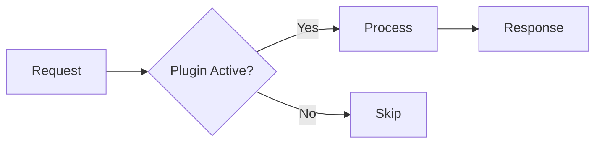

# Gemeinsame Regeln - Wiki.js Dokumentation

Diese Regeln gelten fuer ALLE Projekttypen. Immer zusammen mit dem typ-spezifischen Template laden.

## Bilingual - PFLICHT

Jede Wiki.js-Seite wird in **DE und EN** erstellt/aktualisiert.

- Gleicher Pfad, unterschiedliche Locale (`locale: "de"` / `locale: "en"`)
- Sprachlink oben auf jeder Seite:
  - DE-Seite: `[English Version](https://faq.markus-michalski.net/en/{path})`
  - EN-Seite: `[Deutsche Version](https://faq.markus-michalski.net/de/{path})`
- Code-Beispiele, CLI-Befehle, technische Terme bleiben in beiden Versionen gleich (welche
  Begriffe Lehnwörter bleiben, steht im Glossar von `translation-check`)
- Nur Fliesstext, Ueberschriften, Beschreibungen uebersetzen

## Wiki.js Enhanced Markdown - PFLICHT

Nutze diese Wiki.js-spezifischen Markdown-Features aktiv:

### Callout Boxes (statt normaler Absaetze fuer Warnungen/Tipps)

```markdown
> Wichtiger Sicherheitshinweis: API-Keys niemals im Code speichern.
{.is-warning}

> Tipp: Nutze separate API-Keys fuer verschiedene Integrationen.
{.is-info}

> Fehler: Plugin nicht kompatibel mit osTicket < 1.18
{.is-danger}

> Erfolgreich installiert! Das Plugin ist sofort einsatzbereit.
{.is-success}
```

**KRITISCH - Callout Boxes NIE im Quelltext umbrechen:**

Wiki.js fasst mehrzeilige `>`-Bloecke NICHT wie Standard-CommonMark zu Fliesstext zusammen —
jeder einzelne Zeilenumbruch im Quelltext wird als hartes `<br>` gerendert. Ein Callout muss daher
**immer eine einzige, unumbrochene Zeile** sein, unabhaengig von der Laenge:

```markdown
> Wichtiger Hinweis: Diese lange Warnung wurde bei ca. 90 Zeichen        <-- FALSCH
> umgebrochen, um im Editor besser lesbar zu sein, und rendert in
> Wiki.js mit sichtbaren Zeilenumbruechen mitten im Satz.
{.is-warning}

> Wichtiger Hinweis: Diese lange Warnung steht als eine einzige, unumbrochene Zeile im Quelltext und rendert in Wiki.js als normaler Fliesstext ohne sichtbare Umbrueche.   <-- KORREKT
{.is-warning}
```

### Content Tabs (fuer alternative Wege)

```markdown
### Installation {.tabset}

#### Composer (Empfohlen)
composer require mmd/plugin-name

#### ZIP Download
1. Download von GitHub Releases
2. Entpacken nach /include/plugins/

#### Git Clone
git clone https://github.com/markus-michalski/repo-name.git
```

### Mermaid-Diagramme (Hub und `technical` je mindestens 1)

**KRITISCH - Wiki.js Mermaid 8.8.2 Kompatibilitaet:**

Wiki.js nutzt Mermaid 8.8.2. Folgende Regeln sind PFLICHT:

1. **`graph` statt `flowchart`** - `flowchart` wird NICHT unterstuetzt
   - `graph TD` (top-down) statt `flowchart TD`
   - `graph LR` (left-right) statt `flowchart LR`

2. **Alle Node-Labels in Anfuehrungszeichen** - Sonderzeichen-Sicherheit
   - `A["Label mit Sonderzeichen"]` statt `A[Label mit Sonderzeichen]`

3. **Kein `::` in Labels** - Mermaid interpretiert `::` als CSS-Klassen-Zuweisung
   - `A["enable()"]` statt `A["Plugin::enable()"]`
   - Kurzform nutzen oder Punkt statt Doppelpunkt: `Plugin.enable()`

4. **Kein `*` in Labels** - Wird als Markdown interpretiert
   - `A["removeAll()"]` statt `A["remove*()"]`

````markdown

````

### Bild-Dimensionen (wenn Bilder vorhanden)

```markdown


```

## Keine Emojis in Ueberschriften

UTF8MB4-Encoding-Problem in osTicket/Wiki.js. Emojis nur im Fliesstext erlaubt.

```markdown
## Systemanforderungen              <-- Korrekt
## 🎯 Systemanforderungen           <-- FALSCH (wird zu ????)
```

Diese Regel gilt auch dann, wenn der User eine Ueberschrift woertlich mit Emoji vorgibt — das
Emoji vor der Uebernahme entfernen, nie unveraendert in die veroeffentlichte Seite durchreichen.

## Keine Versionsnummern im Fliesstext - PFLICHT

Wiki.js-Seiten beschreiben immer nur den **aktuellen Stand** des Plugins/Moduls, keine Versionshistorie.

- KEINE "(ab vX.Y.Z)"-Zusaetze an Ueberschriften oder Feature-Beschreibungen — Versionsnummern
  veralten sofort wieder und muessen bei jedem Release nachgepflegt werden (macht in der Praxis
  niemand)
- Versionsgeschichte gehoert ins CHANGELOG.md des Repos, nicht ins Wiki. Es gibt im Wiki auch
  **keinen Changelog-Abschnitt** und keinen Link darauf (sonst wird er doppelt gepflegt, und bei
  privaten Repos laeuft der Link ins Leere)
- Stattdessen: direkt unter dem Sprachlink/den Badges am Seitenanfang ein Hinweis-Callout, dass
  sich die Doku immer auf die aktuellste Version bezieht
- Diese Regel gilt auch dann, wenn der User selbst eine Versionsnummer nennt und erwartet, dass sie
  dokumentiert wird — die Versionsnummer nicht in Ueberschrift/Fliesstext uebernehmen (das
  Hinweis-Callout deckt das ab)

```markdown
> Diese Dokumentation bezieht sich immer auf die aktuellste veroeffentlichte Version.
{.is-info}
```

EN-Pendant:

```markdown
> This documentation always describes the latest published version.
{.is-info}
```

## Hub + Unterseiten - PFLICHT

Jedes Projekt bekommt **keine** Einzelseite mit allen Inhalten, sondern einen **Hub** mit
Unterseiten. Der Grund: Eine Seite mit Installation, Konfiguration, API, Fehlerbehebung und
Technik ist nicht mehr ueberschaubar. Die Regel gilt fuer alle Projekttypen und auch bei
Update/Qualitaets-Upgrade (siehe "Bestehende Einzelseite umbauen").

### Aufbau

```
{typ}/{projekt}                    Hub: kurze Startseite
{typ}/{projekt}/installation       Unterseite
{typ}/{projekt}/configuration      Unterseite
...
```

- Gleicher Pfad fuer DE und EN (nur `locale` unterscheidet sich), daher **englische Slugs**
- Der Hub ist eine kurze Startseite (ca. eine Bildschirmhoehe plus Tabellen), Detailtexte stehen
  auf den Unterseiten
- Fuer jede Unterseite gilt: nur anlegen, wenn es dazu Inhalt gibt. Leere Seiten oder Seiten mit
  einem Absatz sind falsch, der Inhalt gehoert dann in eine verwandte Seite

### Hub-Inhalt (in dieser Reihenfolge)

1. Sprachlink, Link zur Kategorie-Seite, H1, Badges, "aktuelle Version"-Callout
2. Ueberblick (was, fuer wen, Kern-Vorteil als Callout)
3. Ein Mermaid-Uebersichtsdiagramm
4. **Dokumentation**: Tabelle `Seite | Inhalt` mit Links auf alle Unterseiten (ersetzt das
   frueher manuelle Inhaltsverzeichnis)
5. Features (Tabelle), Anforderungen (Tabelle)
6. Lizenz, Support (kein Changelog-Abschnitt)

Alles andere steht auf Unterseiten.

### Standard-Unterseiten

| Slug | Inhalt | Wann |
|------|--------|------|
| `installation` | Installation (Tabs), Update, Deinstallation, Cronjobs/Scheduled Tasks | immer |
| `configuration` | Einstellungen, Admin-Oberflaeche, Praxis-Beispiele | immer, wenn es etwas zu konfigurieren gibt |
| `troubleshooting` | Fehlerbehebung (Symptoms → Check → Solution), bekannte Einschraenkungen, FAQ | immer |
| `technical` | Architektur-Diagramm, Struktur, Entities/Tabellen, Interna | immer |
| typ-spezifisch | siehe Tabelle "Seite → Sektionen" im jeweiligen Typ-Template (z.B. `shop-api`, `storefront`, `extending`, `tools`, `options`) | bei Inhalt |

Bei Projekten mit sehr vielen gleichartigen Eintraegen (z.B. Skills, Check-Typen) ist eine
Referenzseite oder eine weitere Ebene (`/skills`, `/checks/{name}`) erlaubt. Bestehende
inhaltlich benannte Unterseiten (z.B. `plugins/storyforge/writing-modes`) behalten ihren Slug.

### Konventionen fuer jede Unterseite

- Kopf: Sprachlink, Leerzeile, Link zurueck zum Hub, Leerzeile, H1

  ```markdown
  [English Version](https://faq.markus-michalski.net/en/{path})

  [Zurueck zur Uebersicht](/de/{hub-pfad})

  # {Projekt}: {Thema}
  ```

  EN: `[Deutsche Version](https://faq.markus-michalski.net/de/{path})` und
  `[Back to overview](/en/{hub-pfad})`
- Titel: `{Projekt}: {Thema}` (z.B. "ALTCHA: Konfiguration")
- Eigene Description (max 250 Zeichen), die zum Thema der Unterseite passt, nicht die Hub-Description
- Tags wie beim Hub
- Links zwischen Seiten immer als absoluter Wiki-Pfad mit Locale (`/de/...`, `/en/...`), nie als
  `#anchor` auf eine Seite, die es nicht mehr gibt
- Das Mermaid-Pflichtdiagramm liegt auf dem Hub (Uebersicht) und auf `technical` (Detail). Auf den
  uebrigen Unterseiten nur, wenn es den Inhalt klarer macht
- Callouts, Tabs, Troubleshooting-Pattern und alle anderen Regeln dieser Datei gelten
  unveraendert pro Seite

### Link zur Elternseite - PFLICHT

Jede Seite verlinkt auf ihre Elternseite, damit Leser nie in einer Sackgasse landen und zwischen
Kategorien wechseln koennen:

| Seite | Link fuehrt zu | Beispiel |
|-------|----------------|----------|
| Unterseite | Hub | `[Zurueck zur Uebersicht](/de/oxid7/sitemap)` |
| Hub | Kategorie-Seite | `[Alle OXID 7 Plugins](/de/oxid7)` |
| Kategorie-Seite | Home | `[← Zur Hauptuebersicht](/de/home)` |

- Der Link steht direkt unter dem Sprachlink (Markdown) bzw. im Hero-Bereich unter dem Untertitel
  (HTML-Kategorie-Seiten, helle Linkfarbe wegen dunklem Hintergrund)
- Absoluter Wiki-Pfad mit Locale, wie bei allen Links (`/de/...`, `/en/...`)
- EN-Pendants: `Back to overview`, `All OXID 7 Plugins`, `Back to main overview`
- Fehlt die direkte Elternseite (z.B. keine Kategorie-Seite), gilt die naechsthoehere vorhandene
  Seite, sonst Home
- Beim Anlegen einer neuen Seite wird der Link gleich mit gesetzt, bei Update oder Upgrade einer
  Bestandsseite ohne Link wird er nachgezogen

### Kategorie-Seite (Karten-Uebersicht)

Jede Plattform hat eine Kategorie-Seite (`sylius`, `shopware6`, `oxid7`, `osticket`, `mcp`,
`plugins`, `bash-scripts`) mit einer Karte pro Projekt. Die Karte verlinkt **direkt auf die
Unterseiten**, nicht nur auf den Hub: erster Link der Hub, danach die wichtigsten Unterseiten
(Installation, Konfiguration, Fehlerbehebung, typ-spezifische). Bei neuem Projekt wird die Karte
angelegt, bei Umbau oder neuer Unterseite wird sie nachgezogen. Format der Kategorie-Seite
(HTML-Karten oder Markdown-Tabelle) von der bestehenden Seite uebernehmen, nicht neu erfinden.

### Bestehende Einzelseite umbauen (Update und Qualitaets-Upgrade)

Trifft ein Update oder Upgrade auf eine Einzelseite (alles auf einer Seite), wird sie in diesem
Zug zu Hub + Unterseiten umgebaut. Danach nicht zurueck zur Einzelseite.

1. DE und EN laden (`wikijs_get_page`) und die Abschnitte inventarisieren
2. Jedem Abschnitt eine Zielseite zuweisen (Standard-Unterseiten, Tabelle im Typ-Template).
   **Kein Abschnitt darf entfallen.** Vor dem Publish pruefen, dass jeder Abschnitt der alten Seite
   auf genau einer neuen Seite wieder auftaucht
3. Unterseiten zuerst anlegen (`wikijs_create_page`, DE + EN), danach den Hub per
   `wikijs_update_page` auf die Kurzfassung reduzieren. Der Hub wird dabei weniger als halb so
   lang, also `confirmContentShrink: true` setzen (siehe "content ersetzt die GANZE Seite")
4. Bestehende Unterseiten (z.B. bei StoryForge) auf Standard-Slugs pruefen: Weicht ein Slug nur
   in der Schreibweise von einem Standard-Slug ab, mit `wikijs_move_page` umbenennen, inhaltlich
   benannte Slugs behalten. Den Hub um die Dokumentations-Tabelle ergaenzen
5. Eingehende Links reparieren: `wikijs_search_pages` nach Verweisen auf alte `#anchor` und
   Pfade, in anderen Seiten und in der Kategorie-Seite
6. Kategorie-Karte auf die Unterseiten umstellen
7. Mit `wikijs_get_page` pruefen, dass Hub und alle Unterseiten in beiden Sprachen erreichbar
   sind und alle Links aufloesen

Reihenfolge beim **Neu-Anlegen**: Unterseiten zuerst, Hub zuletzt (damit die Links des Hubs nicht
ins Leere laufen), dann Kategorie-Karte.

## Agent-Orchestrierung

Agents in dieser Reihenfolge einsetzen. Nicht alle sind bei jedem Projekt noetig.

### 1. docs-architect (IMMER)

Codebase analysieren und Hauptdokumentation schreiben.

**Prompt-Hinweise fuer den Agent:**
- README.md, CHANGELOG.md, composer.json/package.json lesen
- Quellcode-Struktur verstehen (src/, tests/, config/)
- Bestehende Doku als Basis nehmen (falls Update/Upgrade)
- Wiki.js Enhanced Markdown verwenden

### 2. mermaid-expert (IMMER)

Mindestens 1 Uebersichtsdiagramm fuer den Hub und 1 Detaildiagramm fuer `technical` erstellen.

**WICHTIG:** Mermaid 8.8.2 Kompatibilitaetsregeln beachten (siehe oben):
- `graph` statt `flowchart`, Labels in Quotes, kein `::` oder `*` in Labels

**Diagramm-Typen nach Bedarf:**
- Flowchart (`graph TD`/`graph LR`): Plugin-Lifecycle, Entscheidungslogik
- Sequence: API Request/Response Flow
- Class: Klassen-Struktur (bei komplexen Plugins)
- ER: Datenbank-Schema (bei DB-Erweiterungen)

### 3. tutorial-engineer (bei Neue Doku / Qualitaets-Upgrade)

Step-by-Step Guides mit Tabs fuer alternative Wege.

**Fokus auf:**
- Installation (verschiedene Methoden als Tabs)
- Haeufigste Use Cases mit konkreten Werten
- Troubleshooting als "Symptoms → Check → Solution" Pattern

### 4. api-documenter (nur bei Projekten mit API)

API-Referenz mit Tabellen.

**Erstelle Tabellen fuer:**
- Endpunkte: Method, Path, Description, Parameters
- Parameter: Name, Type, Required, Default, Description
- Response-Codes: Code, Description, Example

### 5. reference-builder (bei umfangreicher Konfiguration)

Parameter- und Config-Referenz-Tabellen.

**Erstelle Tabellen fuer:**
- Environment Variables
- Plugin-Settings
- CLI-Optionen
- Custom Fields

## Wiki.js MCP-Workflow

### content ersetzt die GANZE Seite — kein Diff/Merge

**KRITISCH:** `wikijs_update_page`s `content`-Parameter, wenn gesetzt, ERSETZT den
kompletten Seiteninhalt. Es gibt kein Patchen oder Anhaengen einzelner Abschnitte.
Vor jedem inhaltlichen Update also IMMER zuerst `wikijs_get_page` aufrufen, den
vollstaendigen Content lokal bearbeiten und den GESAMTEN ueberarbeiteten Text als
`content` zurueckschicken — nie nur den geaenderten Ausschnitt.

Ein Update mit nur der geaenderten Zeile (z.B. ein einzelner korrigierter Link) loescht
den Rest der Seite kommentarlos. Als Sicherheitsnetz lehnt der Server ein Update ab,
wenn der neue Content unter 50% der Laenge des bisherigen Contents liegt (ab ca. 200
Zeichen Bestandslaenge) — der Fehler nennt beide Zeichenzahlen. Ist die Kuerzung
tatsaechlich beabsichtigt, `confirmContentShrink: true` mitgeben:

```
wikijs_update_page(path, locale, content, ..., confirmContentShrink: true, isPublished: true)
```

### isPublished PFLICHT

**KRITISCH:** Bei JEDEM `wikijs_create_page` und `wikijs_update_page` Aufruf
IMMER `isPublished: true` explizit setzen! Ohne diesen Parameter werden
Seiten versehentlich als Draft gespeichert.

```
wikijs_create_page(path, locale, content, ..., isPublished: true)
wikijs_update_page(path, locale, content, ..., isPublished: true)
```

### Source-Ref-Tracking (wenn verfuegbar)

Bevor Content geschrieben wird: im Zielprojekt-Verzeichnis (dem Repo, das dokumentiert wird)
den aktuellen Git-Stand ermitteln:

```bash
git -C {zielprojekt-pfad} rev-parse HEAD
# oder, falls das Projekt Tags nutzt:
git -C {zielprojekt-pfad} describe --tags --always
```

Ist das Zielprojekt kein Git-Repo (oder der Befehl schlaegt fehl), Source-Ref-Tracking einfach
auslassen — `sourceRepo`/`sourceRef`/`summary` sind optionale Parameter, kein Blocker fuer den
Publish-Schritt.

Ist ein Git-Stand ermittelbar, bei JEDEM `wikijs_create_page`/`wikijs_update_page`-Aufruf
zusaetzlich mitgeben:

```
wikijs_create_page(path, locale, content, ..., isPublished: true,
                    sourceRepo: "{projektname aus Schritt 2}", sourceRef: "{git-hash}",
                    summary: "{ein Satz, was dokumentiert wurde}")
```

`sourceRepo`/`sourceRef`/`summary` landen NUR in einer lokalen Historie
(`wikijs_get_page_history`) — nie im sichtbaren Seiteninhalt oder in der Description. Das erhaelt
die "Keine Versionsnummern im Fliesstext"-Regel oben, macht aber trotzdem nachvollziehbar, auf
welchem Source-Stand eine Seite zuletzt aktualisiert wurde — nuetzlich bei Projekten mit sehr
haeufigen Aenderungen (z.B. taeglich mehrere Doku-Updates).

### Neue Doku erstellen

Immer als Hub + Unterseiten (siehe "Hub + Unterseiten - PFLICHT"). `path` und `locale` gelten
fuer jede einzelne Seite, die Schritte 5-6 werden also pro Unterseite wiederholt. Der
Translation-Check (Schritt 4) laeuft dagegen einmal ueber den gesamten Seiten-Satz.

```
1. wikijs_search_pages(query: "projektname")                        → Pruefen ob Seite existiert
2. git rev-parse HEAD im Zielprojekt (falls Git-Repo)                → sourceRef ermitteln
3. Seiten-Plan erstellen und Content mit Agents generieren           → Hub + Unterseiten, Enhanced Markdown
4. /wikijs-plugin:translation-check über alle DE- und EN-Seiten      → FAIL: überarbeiten, erneut prüfen; WARN: User fragen
5. wikijs_create_page(path, locale: "de", isPublished: true,
                       sourceRepo, sourceRef, summary, ...)          → je Unterseite DE, dann Hub DE
6. wikijs_create_page(path, locale: "en", isPublished: true,
                       sourceRepo, sourceRef, summary, ...)          → je Unterseite EN, dann Hub EN
7. Kategorie-Seite: Karte mit Links auf die Unterseiten anlegen      → wikijs_get_page + wikijs_update_page
8. wikijs_get_page(path, locale: "de")                               → Hub und Unterseiten verifizieren
```

Unterseiten zuerst, Hub zuletzt, damit die Links des Hubs nicht ins Leere laufen.

### Bestehende Doku updaten

Ist die Doku bereits Hub + Unterseiten, wird nur die betroffene Seite pro Sprache aktualisiert
(und der Hub, falls sich Features/Anforderungen/Dokumentations-Tabelle aendern). Ist sie noch
eine Einzelseite, zuerst "Bestehende Einzelseite umbauen" ausfuehren.

```
1. wikijs_get_page(path, locale: "de")                               → Aktuelle Version laden
2. wikijs_get_page(path, locale: "en")                               → EN-Version laden
3. Einzelseite? → zu Hub + Unterseiten umbauen (siehe oben)          → Umbau vor inhaltlichen Aenderungen
4. git rev-parse HEAD im Zielprojekt (falls Git-Repo)                → sourceRef ermitteln
5. Content mit Agents ueberarbeiten                                  → Aenderungen einarbeiten
6. /wikijs-plugin:translation-check über alle geänderten Seiten      → FAIL: überarbeiten, erneut prüfen; WARN: User fragen
7. wikijs_update_page(path, locale: "de", isPublished: true,
                       sourceRepo, sourceRef, summary, ...)          → DE-Version updaten
8. wikijs_update_page(path, locale: "en", isPublished: true,
                       sourceRepo, sourceRef, summary, ...)          → EN-Version updaten
```

### Qualitaets-Upgrade

```
1. wikijs_get_page(path, locale: "de")                               → Aktuelle Version laden
2. Luecken identifizieren:
   - Einzelseite statt Hub + Unterseiten? → zuerst umbauen (siehe oben)
   - Fehlende Mermaid-Diagramme?
   - Keine Callout Boxes?
   - Flache Troubleshooting-Sektion?
   - Fehlende Tabs fuer alternative Wege?
   - Keine Praxisbeispiele?
3. Agents gezielt einsetzen fuer Luecken
4. git rev-parse HEAD im Zielprojekt (falls Git-Repo)                → sourceRef ermitteln
5. /wikijs-plugin:translation-check über alle geänderten Seiten      → FAIL: überarbeiten, erneut prüfen; WARN: User fragen
6. wikijs_update_page(path, locale: "de", isPublished: true,
                       sourceRepo, sourceRef, summary, ...)          → DE-Version updaten
7. wikijs_update_page(path, locale: "en", isPublished: true,
                       sourceRepo, sourceRef, summary, ...)          → EN-Version updaten
```

## Qualitaets-Checkliste (vor Publish)

Vor dem Erstellen/Updaten ALLE Punkte pruefen:

- [ ] `/wikijs-plugin:translation-check` über DE- und EN-Content durchgelaufen (DE ist hartes Gate, EN höchstens WARN)
- [ ] Translation-Check: PASS, oder WARN mit User-Entscheidung — bei FAIL nicht publizieren
- [ ] Hub + Unterseiten statt Einzelseite; Hub ist eine kurze Startseite mit Dokumentations-Tabelle
- [ ] Jede Unterseite hat Sprachlink, Link zurueck zum Hub, eigene Description und `{Projekt}: {Thema}`-Titel
- [ ] Beim Umbau: jeder Abschnitt der alten Seite steht auf genau einer neuen Seite (nichts verloren)
- [ ] Kategorie-Karte verlinkt auf die Unterseiten
- [ ] Jede Seite verlinkt auf ihre Elternseite (Unterseite → Hub, Hub → Kategorie, Kategorie → Home)
- [ ] Hub und `technical` haben je mindestens 1 Mermaid-Diagramm
- [ ] Callout Boxes fuer Warnungen/Tipps (`.is-warning`, `.is-info`, `.is-danger`, `.is-success`)
- [ ] Keine "(ab vX.Y.Z)"-Versionszusaetze im Fliesstext — stattdessen "aktuelle Version"-Hinweis am Seitenanfang
- [ ] Tabs fuer alternative Installationswege / Konfigurationsmethoden
- [ ] Praxisbeispiele mit konkreten Werten (nicht nur Platzhalter)
- [ ] Troubleshooting mit Symptoms → Check → Solution Pattern
- [ ] Requirements als Tabelle formatiert
- [ ] Keine Emojis in Ueberschriften
- [ ] Tags gesetzt (Projekttyp + Projektname + Themen-Tags)
- [ ] Description ausgefuellt (max 250 Zeichen, beschreibend — siehe Sicherheitsmarge unten)
- [ ] DE + EN Version vorhanden
- [ ] Sprachlink oben auf beiden Versionen korrekt
- [ ] Badges aktuell (Version, CI-Status, Lizenz)
- [ ] `isPublished: true` bei jedem MCP-Aufruf gesetzt
- [ ] Mermaid: `graph` statt `flowchart`, Labels in Quotes, kein `::` oder `*`
- [ ] Callout Boxes (`> ...`) stehen als eine einzige unumbrochene Zeile im Quelltext, nie manuell umgebrochen

## Wiki.js Seiten-Metadaten

### Tags-Konvention

| Projekttyp | Pflicht-Tags | Zusatz-Tags (themenabhaengig) |
|------------|-------------|-------------------------------|
| osTicket | `osticket`, `plugin` | `api`, `markdown`, `subticket`, etc. |
| Shopware6 | `shopware6`, `plugin` | `consent`, `tracking`, `payment`, etc. |
| OXID | `oxid`, `oxid7`, `modul` | `sitemap`, `analytics`, `consent`, etc. |
| Sylius | `sylius`, `plugin` | `spam-protection`, `shop-api`, `checkout`, etc. |
| MCP | `mcp`, `claude-code` | `osticket`, `wikijs`, `api`, etc. |
| Bash | `bash`, `script` | `automation`, `deployment`, etc. |
| Agent | `claude`, `agent` | `skill`, `workflow`, etc. |

### Description-Pattern

```
DE: "[Kurzbeschreibung] fuer [Plattform] - [Hauptfeatures kommasepariert]"
EN: "[Short description] for [Platform] - [Main features comma-separated]"
```

**Max 250 Zeichen** (Sicherheitsmarge). Keine Emojis.

Die Wiki.js-`description`-Spalte ist in der Produktion ein MySQL `VARCHAR(255)` — laengere
Beschreibungen scheitern beim Publish mit `Data too long for column 'description'`. Das
`wikijs_create_page`/`wikijs_update_page`-MCP-Tool nennt in seiner eigenen Docstring faelschlich
"max 500 Zeichen"; massgeblich ist die reale DB-Spalte, nicht die Docstring-Angabe. Vor jedem
Create/Update die Zeichenzahl pruefen und bei > 250 aggressiv kuerzen (Aufzaehlungen/Klammerlisten
zuerst streichen), statt sich auf die 500er-Angabe zu verlassen.
