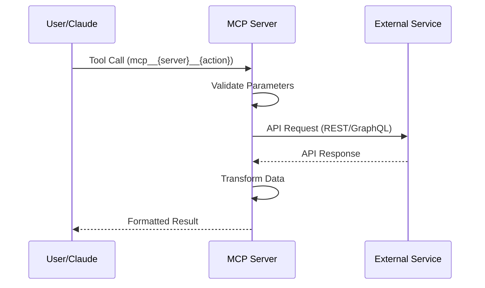
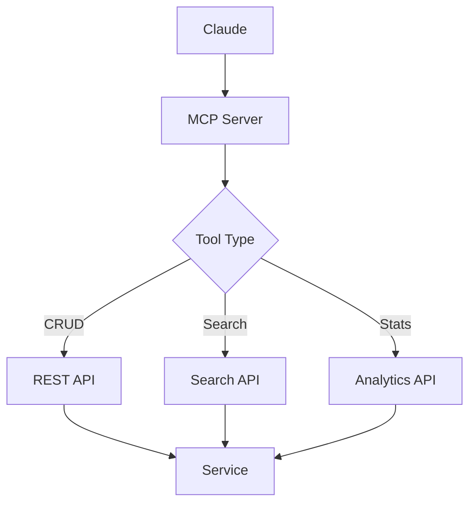

# MCP Server - Wiki.js Dokumentation

## Wiki.js Metadaten

- **Pfad-Pattern:** `mcp/{server-name}` (z.B. `mcp/osticket`)
- **Pflicht-Tags DE:** `mcp`, `claude-code`, `{service-name}`
- **Pflicht-Tags EN:** `mcp`, `claude-code`, `{service-name}`
- **Plattform-Agent:** `mcp-development:mcp-server-architect`

## Badge-Vorlage

```markdown
[](https://github.com/markus-michalski/{REPO_NAME})
[](https://github.com/markus-michalski/{REPO_NAME}/actions)
[](https://github.com/markus-michalski/{REPO_NAME}/blob/main/LICENSE)
[](https://nodejs.org)
[](https://modelcontextprotocol.io)
```

## Seiten-Struktur (Sektionen in dieser Reihenfolge)

### 1. Titel + Badges + Sprachlink

### 2. Inhaltsverzeichnis (manuell)

### 3. Ueberblick
- Was macht der MCP Server, welchen Service integriert er
- Callout Box fuer Kern-Vorteil:

```markdown
> Dieser MCP Server ermoeglicht Claude die direkte Interaktion mit {Service} - ohne manuelles Copy-Paste oder Browser-Wechsel.
{.is-info}
```

### 4. Features
- Feature-Liste mit Checkmarks
- "MCP Protocol Compliant" IMMER erwaehnen

### 5. Anwendungsfaelle
- 3-5 konkrete Use Cases

### 6. Anforderungen
- Tabelle: Anforderung | Version | Hinweise
- Node.js 18+, npm/pnpm, Claude Desktop/CLI, externer Service

### 7. Installation {.tabset}

#### npm Global (Empfohlen)
```bash
npm install -g @markus-michalski/{server-name}
```

#### Git Clone
```bash
git clone ...
npm install && npm run build
```

### 8. Konfiguration

#### Environment Variables (MCP-spezifisch - PFLICHT!)
- IMMER als Tabelle: Variable | Required | Default | Description

```markdown
| Variable | Erforderlich | Standard | Beschreibung |
|----------|-------------|----------|-------------|
| `SERVICE_URL` | Ja | - | Basis-URL der Instanz |
| `SERVICE_API_KEY` | Ja | - | API-Key fuer Authentifizierung |
```

#### Claude Desktop Integration

```json
{
  "mcpServers": {
    "{server-name}": {
      "command": "node",
      "args": ["/path/to/build/index.js"],
      "env": {
        "SERVICE_URL": "https://...",
        "SERVICE_API_KEY": "..."
      }
    }
  }
}
```

#### Claude CLI Integration

```json
{
  "mcpServers": {
    "{server-name}": {
      "command": "npx",
      "args": ["-y", "@markus-michalski/{server-name}"],
      "env": { ... }
    }
  }
}
```

### 9. Verfuegbare Tools (MCP-spezifisch - PFLICHT!)
- IMMER als Tabelle: Tool | Beschreibung | Parameter

```markdown
| Tool | Beschreibung | Parameter |
|------|-------------|-----------|
| `mcp__{server}__{action}` | Was es tut | `param1`, `param2` |
```

- Danach Detail-Sektionen pro Tool (Parameter-Tabelle + Beispiel)

### 10. Verwendung
- Beispiel-Workflows in natuerlicher Sprache
- "Sage Claude: ..." Beispiele

### 11. Fehlerbehebung
- Mindestens 4 Probleme:
  - MCP Server laedt nicht
  - Authentifizierung fehlgeschlagen
  - Tools reagieren nicht / Timeout
  - Berechtigungsfehler

### 12. Technische Details
- Server-Verzeichnisstruktur
- MCP-Protokoll-Info (Transport: stdio, Version: 1.0)
- Architektur-Diagramm (Mermaid PFLICHT)
- Security Features
- Rate Limiting / Caching

### 13. FAQ
- "Was ist MCP?" IMMER als erste Frage
- Kompatibilitaet mit anderen Clients
- Node.js Version

### 14. Lizenz (MIT)

### 15. Support + Changelog

## Mermaid-Diagramm-Vorlage

Client → MCP Server → External API:

````markdown

````

Fuer Server mit mehreren Services:

````markdown

````

## Agent-Einsatz fuer MCP Server

1. **docs-architect** → package.json, src/index.ts, src/tools/ analysieren
2. **mermaid-expert** → Client-Server-Sequenzdiagramm
3. **tutorial-engineer** → Installation als Tabs, Workflow-Beispiele
4. **api-documenter** → Tool-Referenz-Tabellen (Parameter, Return Types)
5. **reference-builder** → Environment Variables, Tool-Parameter-Referenz
