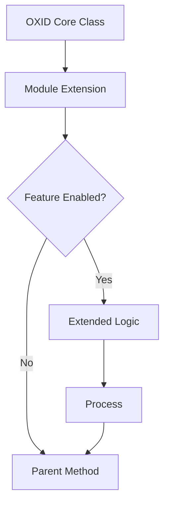
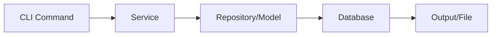

# OXID 7 Modul - Wiki.js Dokumentation

## Wiki.js Metadaten

- **Pfad-Pattern:** `oxid7/{modul-name}` (z.B. `oxid7/sitemap`)
- **Pflicht-Tags DE:** `oxid`, `oxid7`, `modul`, `{modul-thema}`
- **Pflicht-Tags EN:** `oxid`, `oxid7`, `module`, `{module-topic}`
- **Plattform-Agent:** `oxid-development:oxid7-pro`

## Badge-Vorlage

### Open Source (GitHub)

```markdown
[](https://github.com/markus-michalski/{REPO_NAME})
[](https://github.com/markus-michalski/{REPO_NAME}/actions)
[](https://github.com/markus-michalski/{REPO_NAME}/blob/main/LICENSE)
[](https://www.oxid-esales.com)
[](https://www.php.net/)
```

### Kommerziell

```markdown
[](https://www.oxid-esales.com)
[](https://www.php.net/)
```

## Seiten-Struktur (Sektionen in dieser Reihenfolge)

Die Sektionen unten sind nicht eine Seite, sondern werden nach der Regel "Hub + Unterseiten"
(siehe DOCS_COMMON.md) auf Hub und Unterseiten verteilt. Die Nummern bleiben die Reihenfolge
innerhalb ihrer Seite. Eine Unterseite wird nur angelegt, wenn es dazu Inhalt gibt.

| Seite | Pfad | Sektionen |
|-------|------|-----------|
| Hub | `oxid7/{modul}` | 1, 3, 4, 5, 15, 16 (kurz, mit Dokumentations-Tabelle) |
| Installation | `.../installation` | 6, 7 |
| Konfiguration | `.../configuration` | 8, 11 |
| Console Commands | `.../commands` | 9 |
| Fehlerbehebung | `.../troubleshooting` | 12, 14 |
| Technik | `.../technical` | 10, 13 |

Sektion "Inhaltsverzeichnis (manuell)" entfaellt, sie wird durch die Dokumentations-Tabelle auf dem Hub ersetzt.


### 1. Titel + Badges + Sprachlink

### 2. Inhaltsverzeichnis (manuell)

### 3. Ueberblick
- Was macht das Modul, fuer wen
- Problem/Loesung mit Callout Box

### 4. Features
- Feature-Tabelle: Feature | Beschreibung

### 5. Anforderungen
- Tabelle: Anforderung | Version | Hinweise
- OXID 7.x, PHP 8.2+, Composer

### 6. Installation {.tabset}

#### Via Composer (Empfohlen)

Fuer private Repositories ueber Packeton:

```markdown
> **Hinweis:** Private Repositories werden ueber Packeton verwaltet. Zugangsdaten nach Lizenzkauf.
{.is-info}
```

```bash
composer require mmd/{modulename}
```

#### Manuell (Git Clone)

Danach IMMER:
```bash
vendor/bin/oe-console oe:module:install-configuration source/modules/mmd/{modulename}
vendor/bin/oe-console oe:module:activate mmd_{modulename}
vendor/bin/oe-console oe:cache:clear
```

### 7. Update
- Composer update + Cache clear

### 8. Konfiguration
- Modul-Einstellungen als Tabelle
- Pfad: Admin → Erweiterungen → Module → {Modulname} → Einstell.

### 9. Console Commands (OXID-spezifisch, falls vorhanden)
- Tabelle: Command | Beschreibung | Optionen

```markdown
| Command | Beschreibung |
|---------|-------------|
| `oe-console mmd:{command}` | Beschreibung |
```

### 10. Chain Extending (OXID-spezifisch, falls vorhanden)
- Welche Core-Klassen erweitert werden
- Tabelle: Original-Klasse | Erweiterte Klasse | Zweck

### 11. Praxis-Beispiele
- Konkrete Konfigurationsbeispiele

### 12. Fehlerbehebung
- Mindestens 3 Probleme mit Symptoms → Check → Solution Pattern

> Modulaktivierung schlaegt fehl? Cache leeren und erneut versuchen:
> ```bash
> vendor/bin/oe-console oe:cache:clear
> ```
{.is-warning}

### 13. Technische Details
- Modul-Struktur als Code-Block (src/, metadata.php, etc.)
- Architektur-Diagramm (Mermaid PFLICHT)
- metadata.php Auszug
- services.yaml Uebersicht

### 14. FAQ

### 15. Lizenz

### 16. Support

## Mermaid-Diagramm-Vorlage

Module-Chain / Event-Flow:

````markdown

````

Fuer Module mit Console Commands:

````markdown

````

## Agent-Einsatz fuer OXID 7

1. **docs-architect** → metadata.php, composer.json, services.yaml, src/ analysieren
2. **mermaid-expert** → Module-Chain-Diagramm, Command-Flow
3. **tutorial-engineer** → Installation als Tabs, Console Commands Beispiele
4. **reference-builder** → Settings-Tabelle, Console Commands, Chain Extensions
