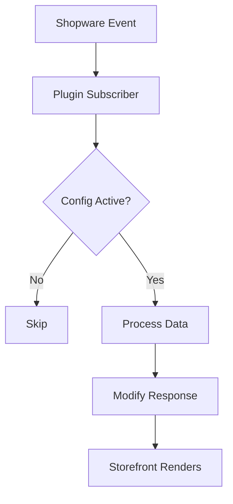
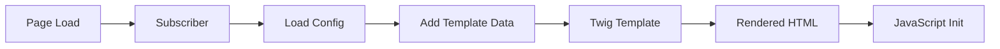

# Shopware 6 Plugin - Wiki.js Dokumentation

## Wiki.js Metadaten

- **Pfad-Pattern:** `shopware6/{plugin-name}` (z.B. `shopware6/klaro-consent`)
- **Pflicht-Tags DE:** `shopware6`, `plugin`, `{plugin-thema}`
- **Pflicht-Tags EN:** `shopware6`, `plugin`, `{plugin-topic}`
- **Plattform-Agent:** `shopware-development:shopware6-pro`

## Badge-Vorlage

### Open Source (GitHub)

```markdown
[](https://github.com/markus-michalski/{REPO_NAME})
[](https://github.com/markus-michalski/{REPO_NAME}/actions)
[](https://github.com/markus-michalski/{REPO_NAME}/blob/main/LICENSE)
[](https://www.shopware.com)
[](https://www.php.net/)
```

### Kommerziell (Shopware Store)

```markdown
[](https://www.shopware.com)
[](https://www.php.net/)
```

## Seiten-Struktur (Sektionen in dieser Reihenfolge)

Die Sektionen unten sind nicht eine Seite, sondern werden nach der Regel "Hub + Unterseiten"
(siehe DOCS_COMMON.md) auf Hub und Unterseiten verteilt. Die Nummern bleiben die Reihenfolge
innerhalb ihrer Seite. Eine Unterseite wird nur angelegt, wenn es dazu Inhalt gibt.

| Seite | Pfad | Sektionen |
|-------|------|-----------|
| Hub | `shopware6/{projekt}` | 1, 3, 4, 5, 16, 17 (kurz, mit Dokumentations-Tabelle) |
| Installation | `.../installation` | 6, 7, 12 |
| Konfiguration | `.../configuration` | 8, 9, 11 |
| Storefront | `.../storefront` | 10 |
| Fehlerbehebung | `.../troubleshooting` | 13, 15 |
| Technik | `.../technical` | 14 |

Sektion "Inhaltsverzeichnis (manuell)" entfaellt, sie wird durch die Dokumentations-Tabelle auf dem Hub ersetzt.


### 1. Titel + Badges + Sprachlink

### 2. Inhaltsverzeichnis (manuell)

### 3. Ueberblick
- Was macht das Plugin, fuer wen
- Callout Box fuer Kern-Vorteil:

```markdown
> **Datenschutz:** Dieses Plugin ist vollstaendig selbst-gehostet. Es werden keine Daten an externe Services gesendet.
{.is-success}
```

### 4. Features
- Feature-Tabelle: Feature | Beschreibung

### 5. Anforderungen
- Tabelle: Anforderung | Version | Hinweise
- Shopware 6.6.x / 6.7.x, PHP 8.2+, Lizenz

### 6. Installation {.tabset}

#### Via Shopware Store (Empfohlen)
#### Via Composer

Composer-Installationen nutzen Packeton:

```markdown
> **Hinweis:** Die Repository-Zugangsdaten werden nach dem Lizenzkauf bereitgestellt. Private Repositories werden ueber Packeton verwaltet.
{.is-info}
```

Danach IMMER:
```bash
bin/console plugin:refresh
bin/console plugin:install --activate {PluginName}
bin/console cache:clear
```

### 7. Update
- Composer update Befehl
- Cache clear

### 8. Konfiguration
- Plugin-Einstellungen als Tabelle: Einstellung | Standard | Beschreibung
- Gruppiert nach Tabs wenn viele Settings:

```markdown
### Einstellungen {.tabset}

#### Allgemein
[Tabelle]

#### Darstellung
[Tabelle]

#### Erweitert
[Tabelle]
```

### 9. Admin-Modul (Shopware-spezifisch, falls vorhanden)
- Admin-Oberflaeche beschreiben
- Entitaets-Verwaltung (CRUD)
- Felder als Tabelle

### 10. Storefront-Integration (Shopware-spezifisch, falls vorhanden)
- Template-Aenderungen
- Theme-Kompatibilitaet
- CSS/JS-Anpassungen

### 11. Praxis-Beispiele
- Mindestens 2-3 konkrete Konfigurationsbeispiele
- Mit realistischen Werten (nicht Platzhalter)

### 12. Scheduled Tasks (falls vorhanden)
- Task-Name, Intervall, Beschreibung

### 13. Fehlerbehebung
- Mindestens 3 Probleme mit Symptoms → Check → Solution Pattern

### 14. Technische Details
- Architektur-Diagramm (Mermaid PFLICHT)
- Plugin-Struktur als Code-Block
- Subscriber/Event-Listener Uebersicht

### 15. FAQ
- Gruppiert: Allgemein, Konfiguration, Kompatibilitaet

### 16. Lizenz
- Open Source: MIT
- Kommerziell: Einzelinstallations-Lizenz

### 17. Support
- E-Mail: support@markus-michalski.net
- Oder GitHub Issues (bei Open Source)


## Mermaid-Diagramm-Vorlage

Plugin-Lifecycle / Subscriber-Flow:

````markdown

````

Fuer Plugins mit Storefront-Integration:

````markdown

````

## Agent-Einsatz fuer Shopware 6

1. **docs-architect** → composer.json, Plugin-Klasse, Subscriber, Services analysieren
2. **mermaid-expert** → Plugin-Lifecycle-Diagramm, Storefront-Flow
3. **tutorial-engineer** → Installation als Tabs, Konfigurationsbeispiele, Use Cases
4. **api-documenter** → Nur bei Plugins mit eigenem API-Endpunkt
5. **reference-builder** → Plugin-Config-Tabelle, Custom Fields, Scheduled Tasks
