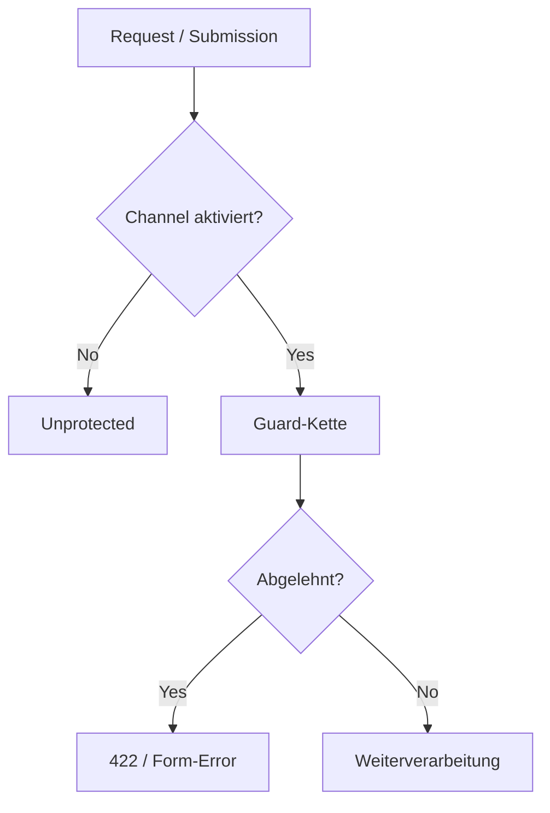
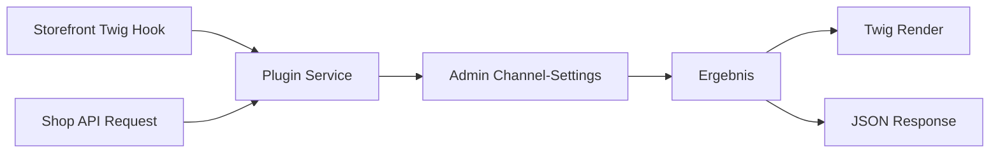

# Sylius Plugin - Wiki.js Dokumentation

## Wiki.js Metadaten

- **Pfad-Pattern:** `sylius/{plugin-name}` (z.B. `sylius/altcha`, ohne `mmd`-Vendor-Praefix)
- **Pflicht-Tags DE:** `sylius`, `plugin`, `{plugin-thema}`
- **Pflicht-Tags EN:** `sylius`, `plugin`, `{plugin-topic}`
- **Plattform-Agent:** keiner. `oxid-development`/`shopware-development` existieren als Marketplace
  nicht mehr aktiv gepflegt (ihre Agenten sind in mm-dev-toolkit als `knowledge/` internalisiert) -
  fuer Sylius gibt es kein Pendant. docs-architect analysiert direkt ohne Plattform-Spezialisierung;
  ist devkit aktiv, kann `mm-dev-toolkit:research`/die Sylius-Knowledge ergaenzend herangezogen werden.

## Badge-Vorlage

### Variante waehlen: Sichtbarkeit des Repos pruefen, nicht annehmen

```bash
gh repo view markus-michalski/{REPO_NAME} --json isPrivate
```

Lizenz und Sichtbarkeit sind zwei verschiedene Dinge (ein Plugin kann MIT-lizenziert und trotzdem
privat sein). Badges, die auf GitHub zeigen, funktionieren fuer Wiki-Leser ohne Repo-Zugriff nur
bei oeffentlichen Repos: bei privaten ergibt der Link ein 404, und das CI-Badge-Bild (kommt direkt
von github.com) ist fuer Anonyme kaputt.

### Oeffentliches Repo

```markdown
[](https://github.com/markus-michalski/{REPO_NAME})
[](https://github.com/markus-michalski/{REPO_NAME}/blob/main/LICENSE)
[](https://sylius.com)
[](https://www.php.net/)
```

CI-Badge nur ergaenzen, wenn `.github/workflows/ci.yml` im Repo tatsaechlich existiert:

```markdown
[](https://github.com/markus-michalski/{REPO_NAME}/actions)
```

`{LIZENZ}` aus der tatsaechlichen LICENSE-Datei uebernehmen (MIT, GPL v3, ...) - nicht annehmen.

### Privates Repo (Composer ueber Packeton)

Sylius-Plugins haben kein Store-Pendant wie Shopware; private Plugins laufen ausschliesslich ueber
Composer + Packeton. Keine GitHub-, CI- oder verlinkten License-Badges. Die Lizenz darf als Bild
ohne Link erscheinen, wenn sie fuer Leser relevant ist:

```markdown
[](https://sylius.com)
[](https://www.php.net/)

```

Bei privaten Repos entfallen auch alle anderen Links nach GitHub: Abschnitt 21 "Support" nennt nur
die Support-Mail (keine GitHub Issues), Abschnitt 22 "Changelog" gibt den Inhalt direkt im Wiki
wieder statt auf `CHANGELOG.md` zu verlinken, und das "aktuelle Version"-Callout aus DOCS_COMMON
wird ohne CHANGELOG-Link formuliert.

## Seiten-Struktur (Sektionen in dieser Reihenfolge)

### 1. Titel + Badges + Sprachlink

### 2. Inhaltsverzeichnis (manuell)

### 3. Ueberblick
- Was macht das Plugin, fuer wen
- Callout Box fuer Kern-Vorteil:

```markdown
> **Datenschutz:** Dieses Plugin ist vollstaendig selbst-gehostet. Es werden keine Daten an externe Services gesendet.
{.is-success}
```

### 4. Features
- Feature-Tabelle: Feature | Beschreibung

### 5. Anforderungen
- Tabelle: Anforderung | Version | Hinweise
- Sylius-Version (z.B. `^2.0`), PHP-Version, benoetigte PHP-Extensions
- Datenbank-Einschraenkung falls vorhanden (z.B. "MySQL/MariaDB Pflicht, Migrationen sind
  MySQL-DDL - PostgreSQL wird NICHT unterstuetzt") - nur dokumentieren, wenn das Plugin das
  tatsaechlich einschraenkt, nicht pauschal uebernehmen
- Secret-/Verschluesselungs-Voraussetzung falls vorhanden (z.B. "nicht-leerer `APP_SECRET`")

### 6. Installation {.tabset}

#### Composer (Packeton, falls privat)

```markdown
> **Hinweis:** Private Repositories werden ueber Packeton verwaltet (`https://packeton.markus-michalski.net`). Zugangsdaten nach Lizenzkauf/Freigabe.
{.is-info}
```

```json
{ "repositories": [{ "type": "composer", "url": "https://packeton.markus-michalski.net" }] }
```

```bash
composer require mmd/{plugin-name}
```

#### Composer (Packagist, falls Open Source)

```bash
composer require mmd/{plugin-name}
```

Nach dem `composer require` (beide Tabs, IMMER in dieser Reihenfolge):

1. Bundle registrieren in `config/bundles.php`:
   ```php
   Mmd\{PluginNamespace}\Mmd{PluginNamespace}::class => ['all' => true],
   ```
2. Routen importieren (ein oder zwei Dateien, je nachdem ob das Plugin Admin- und/oder
   Shop-Bereich hat):
   ```yaml
   mmd_{plugin}_admin:
       resource: "@Mmd{PluginNamespace}/config/routes/admin.yaml"

   mmd_{plugin}_shop:
       resource: "@Mmd{PluginNamespace}/config/routes/shop.yaml"
   ```
3. Setup-Command ausfuehren (Standard bei MM-Sylius-Plugins, im Plugin pruefen:
   `src/Command/SetupCommand.php`, Name via `#[AsCommand]`). NICHT `doctrine:migrations:migrate`,
   siehe [Migrationen](#migrationen):
   ```bash
   bin/console mmd:{plugin}:setup
   ```
   Was der Command tut, im Fliesstext erklaeren:
   - fuehrt nur die noch offenen Migrationen dieses Plugins aus, nichts von der App oder anderen
     Plugins
   - idempotent: ohne neue Migration passiert nichts, auch nach jedem `composer update` gefahrlos
   - prueft, ob die Routen aus Schritt 2 importiert sind, und gibt sonst den Snippet aus
     (schreibt nie in `config/`)
   - bricht ab, wenn Migrationen, auf denen es aufbaut (Sylius-Core), noch offen sind, mit dem
     Hinweis, erst `doctrine:migrations:migrate` auszufuehren
   - fragt interaktiv um Bestaetigung; in Skripten `--no-interaction`
   - als derselbe User wie die uebrigen Console-Commands ausfuehren
4. Assets installieren, falls das Plugin eigene Assets mitbringt:
   ```bash
   bin/console assets:install
   ```

### 7. Update
- `composer update mmd/{plugin-name}`
- Migrations-/Setup-Befehl erneut ausfuehren (idempotent, siehe [Migrationen](#migrationen))
- Cache clear

### 8. Konfiguration
- Admin-Pfad-Konvention: **Admin-Sidebar -> MMKreativ Plugins -> {Plugin-Menuepunkt}**
- Falls Channel-spezifisch (bei MM-Sylius-Plugins der Regelfall): eine Einstellung *pro Channel*,
  nicht global - das explizit erwaehnen
- Einstellungen als Tabelle: Einstellung | Standard | Beschreibung
- Gruppiert nach Tabs wenn viele Settings (analog Shopware/OXID-Vorlage)

### 9. Admin-Grids
- Sylius-spezifisch: eigene Admin-Grids (`config/grids/*.yaml`), nicht "Admin-Modul" wie bei
  Shopware
- Pro Grid: Zweck, erreichbar ueber welchen Button/Menuepunkt, welche Spalten/Filter
- CRUD-faehige Grids (ResourceBundle) von reinen Lese-Listen (z.B. ein Log) unterscheiden

### 10. Storefront-Integration
- Twig Hooks (``) die das Plugin registriert bzw. konsumiert
- Falls eine eigene Twig-Funktion zusaetzlich zum Hook existiert (wie bei altcha
  `mmd_altcha_widget()`): beide Wege zeigen, inkl. wann `_prefixes: []` noetig ist (Hook wird aus
  einem bereits von einem Hook gerenderten Template aufgerufen)
- Theme-Kompatibilitaet: was passiert, wenn ein Theme das Template mit dem Hook ersetzt

### 11. Shop API / Headless
- Sylius-Plugins sind **dual-mode** (Storefront + Shop API) - diese Sektion ist PFLICHT, auch wenn
  knapp, nie weglassen
- Endpunkt(e) als Tabelle: Method | Path | Beschreibung
- Request/Response-Beispiel mit `curl`
- Fehlerformat (Status-Codes, Response-Body-Shape, z.B. `{"message": "...", "reason": "..."}`)

### 12. Erweiterbarkeit
- Sylius-spezifisch: wie andere Plugins/die App dieses Plugin erweitern
- Service-Tags (z.B. `mmd_{plugin}.{extension_point}`) mit Beispiel-Service-Definition
- Von Interfaces vs. von Value-Objects ableiten - Empfehlung des Plugins uebernehmen, falls es
  eine aeussert (z.B. "Value-Object-Konstruktor statt Interface, da Interface-Methoden in
  Minor-Releases wachsen koennen")

### 13. Praxis-Beispiele
- Mindestens 2-3 konkrete Konfigurationsbeispiele mit realistischen Werten

### 14. Scheduled Tasks / Konsolen-Befehle
- Tabelle: Command | Intervall-Empfehlung | Beschreibung
- Nur Befehle, die der Betreiber selbst schedulen muss (Cleanup, Daten-Refresh) - Setup/Migration
  gehoert zu Abschnitt 6/7

### 15. Fehlerbehebung
- Mindestens 3 Probleme mit Symptoms -> Check -> Solution Pattern

### 16. Technische Details
- Architektur-/Flow-Diagramm (Mermaid PFLICHT)
- Plugin-Struktur als Code-Block (src/-Unterordner, config/, Resources/)
- Entity-/Migrations-Uebersicht falls eigene Tabellen (ER-Diagramm bei >2 Entities sinnvoll)

### 17. Backward Compatibility
- Sylius-Plugin-spezifisch: falls das Plugin eine explizite Semver-/BC-Zusage dokumentiert
  (Interfaces, Value-Objects, Service-IDs, Twig-Funktions-/Hook-Namen, Routen-Namen,
  Target-/Config-Codes), diese Zusage 1:1 uebernehmen statt neu zu formulieren - sie ist die
  vertragliche Grundlage fuer Integratoren
- Nur aufnehmen, wenn das Plugin das tatsaechlich dokumentiert; sonst Abschnitt weglassen

### 18. Bekannte Einschraenkungen
- Nur aufnehmen, wenn das Plugin selbst Grenzen dokumentiert (README-Abschnitt "Limitations" o.ae.)
- Ehrlich uebernehmen, nicht abschwaechen - das ist fuer Integratoren relevanter als ein weiteres
  Feature

### 19. FAQ
- Gruppiert: Allgemein, Konfiguration, Kompatibilitaet

### 20. Lizenz

### 21. Support
- E-Mail: support@markus-michalski.net
- GitHub Issues nur bei oeffentlichem Repo

### 22. Changelog
- Oeffentliches Repo: nur Link auf CHANGELOG.md
- Privates Repo: Link waere ein 404, Inhalt stattdessen direkt im Wiki wiedergeben

## Migrationen (eigener Hinweisblock, kein Sections-Punkt)

Sylius-Plugins mit eigenen Tabellen bringen eigene Doctrine-Migrationen mit. Der Standardweg ist
der plugin-eigene Setup-Command (`mmd:{plugin}:setup`, siehe Installation Schritt 3): er fuehrt
*nur* die Migrationen dieses Plugins aus und ist deshalb in Multi-Plugin-Projekten sicherer als
das globale `doctrine:migrations:migrate`. Das globale Kommando bleibt nutzbar und wird nur
gebraucht, wenn der Setup-Command meldet, dass Sylius-Migrationen noch offen sind. Fehlt der
Setup-Command in einem Plugin, auf `doctrine:migrations:migrate` zurueckfallen.

Bei Uninstall-Anleitung immer die Reihenfolge nennen: Templates/Hooks entfernen -> Migrationen
*mit noch registriertem Bundle* zurückrollen (`doctrine:migrations:execute --down`, pro Version
einzeln, neueste zuerst) -> Routen-Imports und Bundle-Eintrag entfernen -> `composer remove`.

## Mermaid-Diagramm-Vorlage

Enforcement-/Entscheidungs-Flow (wenn das Plugin Requests/Submissions prueft/filtert):

````markdown

````

Dual-Mode Storefront + Shop API (immer sinnvoll, da Sylius-Plugins dual-mode sind):

````markdown

````

Bei eigenen Entities zusaetzlich ein ER-Diagramm, falls mehr als zwei Tabellen beteiligt sind.

## Agent-Einsatz fuer Sylius

1. **docs-architect** (IMMER) - composer.json, `src/Entity/`, `src/Command/`, `config/` (grids,
   routes, twig_hooks), README analysieren
2. **mermaid-expert** (IMMER) - Enforcement-/Entscheidungs-Flow, Dual-Mode-Diagramm, ggf.
   ER-Diagramm bei mehreren Entities
3. **tutorial-engineer** (bei Neue Doku / Qualitaets-Upgrade) - Installation als Tabs
   (Packeton/Packagist), je ein Praxisbeispiel Storefront UND Shop API (Dual-Mode nie nur einseitig
   zeigen)
4. **api-documenter** (immer, wenn das Plugin Shop-API-Endpunkte hat - bei MM-Sylius-Plugins der
   Regelfall) - Endpunkt-Tabelle, Request/Response-Beispiele, Fehlerformat
5. **reference-builder** (bei Settings/Migrationen/Commands) - Settings-Tabelle,
   Konsolen-Befehle, Migrations-/Entity-Liste, Extension-Point-Interfaces
