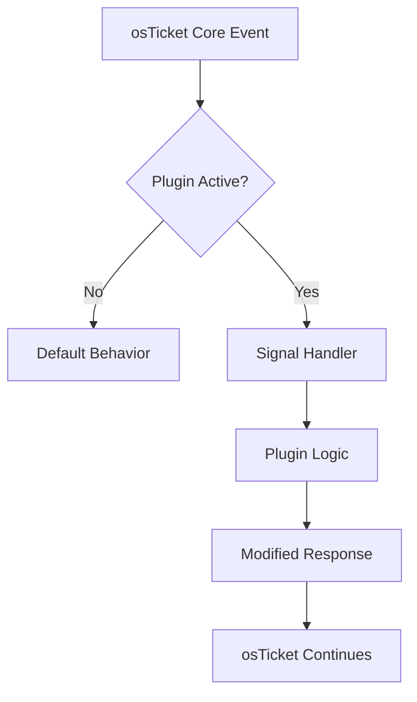
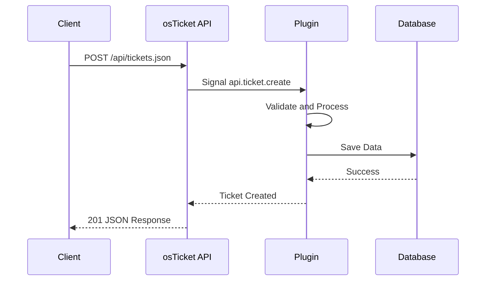

# osTicket Plugin - Wiki.js Dokumentation

## Wiki.js Metadaten

- **Pfad-Pattern:** `osticket/{plugin-name}` (z.B. `osticket/api-endpoints`)
- **Pflicht-Tags DE:** `osticket`, `plugin`, `{plugin-thema}`
- **Pflicht-Tags EN:** `osticket`, `plugin`, `{plugin-topic}`
- **Plattform-Agent:** `osticket-development:osticket-pro`

## Badge-Vorlage

```markdown
[](https://github.com/markus-michalski/osticket-{REPO_NAME})
[](https://github.com/markus-michalski/osticket-{REPO_NAME}/actions)
[](https://github.com/markus-michalski/osticket-{REPO_NAME}/blob/main/LICENSE)
[](https://osticket.com)
[](https://www.php.net/)
```

## Seiten-Struktur (Sektionen in dieser Reihenfolge)

### 1. Titel + Badges + Sprachlink

### 2. Inhaltsverzeichnis (manuell)

### 3. Ueberblick
- 2-3 Absaetze: Was, fuer wen, warum
- Problem/Loesung Darstellung mit Callout Box:

```markdown
> **Ohne dieses Plugin:** [Problem-Beschreibung]
{.is-danger}

> **Mit diesem Plugin:** [Loesung-Beschreibung]
{.is-success}
```

### 4. Hauptfunktionen
- Feature-Liste mit Checkmarks im Fliesstext
- "Keine Core-Modifikationen" IMMER erwaehnen

### 5. Anwendungsfaelle
- 3-5 konkrete Use Cases mit Beschreibung

### 6. Systemanforderungen
- IMMER als Tabelle: Anforderung | Version | Hinweise
- Optionale Abhaengigkeiten separat

### 7. Installation {.tabset}

#### ZIP Download (Empfohlen)
#### Git Clone
#### Composer (falls verfuegbar)

Danach: Plugin aktivieren (Admin Panel → Verwalten → Plugins)

### 8. Konfiguration
- Settings als Tabelle: Einstellung | Beschreibung | Standard | Wann nutzen
- Oder: "Das Plugin benoetigt keine Konfiguration"

### 9. Verwendung
- Plugin-spezifisch (Toolbar Buttons, Admin Interface, API, etc.)

### 10. Signal Hooks (osTicket-spezifisch!)
- PFLICHT-Sektion fuer osTicket Plugins
- Tabelle: Signal | Handler | Zweck

```markdown
| Signal | Handler | Zweck |
|--------|---------|-------|
| `signal.name` | `methodName()` | Beschreibung |
```

### 11. Fehlerbehebung
- Mindestens 3 Probleme
- IMMER dieses Pattern:

```markdown
### Problem: [Titel]

**Symptome:**
- Symptom 1
- Symptom 2

**Pruefung:**
1. Check 1
2. Check 2

**Loesung:**
[Loesung mit Code-Beispiel wenn moeglich]
```

### 12. Technische Details
- Plugin-Verzeichnisstruktur als Code-Block
- Architektur-Diagramm (Mermaid PFLICHT)
- Security Features
- Performance Optimizations

### 13. FAQ
- Gruppiert: Allgemein, Kompatibilitaet, Erweitert
- Q/A Format

### 14. Lizenz
- GPL v2 (Standard fuer osTicket Plugins)

### 15. Support
- GitHub Issue Tracker Link
- "Beim Melden angeben:" Liste

### 16. Changelog
- Nur Link auf CHANGELOG.md im Repo

## Mermaid-Diagramm-Vorlage

Signal-Flow-Diagramm fuer osTicket Plugins:

````markdown

````

Fuer Plugins mit API:

````markdown

````

## Agent-Einsatz fuer osTicket

1. **docs-architect** → README.md, plugin.php, config.php, Signal-Handler analysieren
2. **mermaid-expert** → Signal-Flow-Diagramm, ggf. API-Sequenzdiagramm
3. **tutorial-engineer** → Installation als Tabs, Use-Case-basierte Anleitungen
4. **api-documenter** → Nur falls Plugin API-Endpunkte bereitstellt
5. **reference-builder** → Admin-Settings-Tabelle, Signal-Hook-Tabelle
